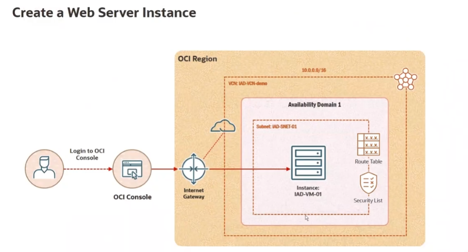
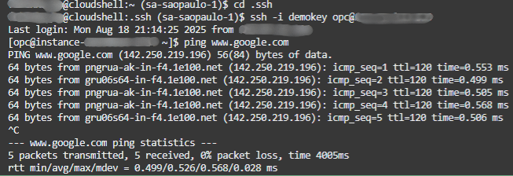
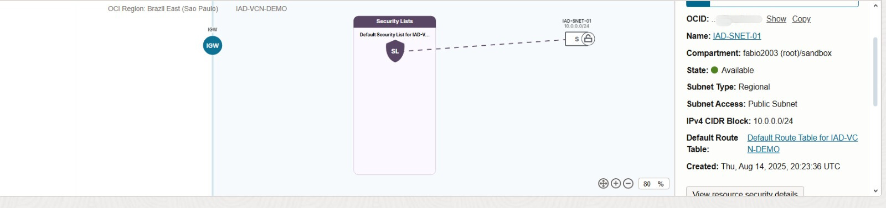
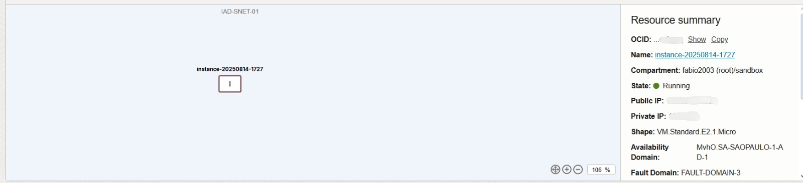

# Provisionamento de Instância Compute com VCN e Subnet na Oracle Cloud (OCI)

Este projeto demonstra o provisionamento de uma **instância de computação (VM)** em uma rede virtual (VCN) na **Oracle Cloud Infrastructure (OCI)**, incluindo:
- Criação de VCN
- Configuração de Subnet pública
- Associação de Internet Gateway
- Configuração de Security List
- Conexão via SSH
- Teste de conectividade com a internet

---

## 🚀 Objetivo do Projeto
**O objetivo é demonstrar a criação de uma infraestrutura mínima na Oracle Cloud Infrastructure (OCI), capaz de hospedar uma máquina virtual acessível via SSH e com acesso à internet. Além disso, o projeto busca:**

- Explorar conceitos básicos de rede em nuvem, como VCN, sub-redes, gateways e regras de segurança.

- Garantir conectividade segura, utilizando pares de chaves SSH para acesso remoto.

- Configurar regras de firewall (Security Lists/NSG) para restringir e controlar o tráfego de entrada e saída.

- Servir como material de estudo/portfólio, validando conhecimentos práticos em cloud computing e infraestrutura como serviço (IaaS)
---

## 🛠️ Recursos Utilizados
- **Oracle Cloud Infrastructure (OCI) Free Tier**
- **Compute (VM.Standard.E2.1.Micro)**
- **VCN (Virtual Cloud Network)**
- **Subnet pública**
- **Internet Gateway**
- **Security List (regra para SSH – porta 22)**

---

## 📜 Arquitetura

[](screenshots/diagrama.png)
*VCN com Subnet pública, Security List e Internet Gateway configurados.*

---

## 📷 Evidências do Ambiente

### 1) Conexão via SSH e ping
[](screenshots/terminal.png)
*Conexão via SSH utilizando chave privada e teste de conectividade (ping para Google).*

---

### 2) Configuração da Subnet
[](screenshots/oci-subnet.jpg)
*Subnet pública criada (CIDR 10.0.0.0/24) com roteamento para Internet Gateway.*

### 3) Instância em execução (Resource Summary)
[](screenshots/oci-instance.png)
*Instância criada e em execução.*

---

## 📌 Passo a Passo Resumido

1. Criar **VCN** com CIDR `10.0.0.0/16`
2. Criar **Subnet Pública** com CIDR `10.0.0.0/24`
3. Associar **Internet Gateway** e configurar rota
4. Configurar **Security List** permitindo SSH (porta 22)
5. Criar **Instância Compute** (VM.Standard.E2.1.Micro)
6. Conectar via SSH:
   ```bash
   ssh -i demokey opc@<IP_PÚBLICO_DA_VM>
